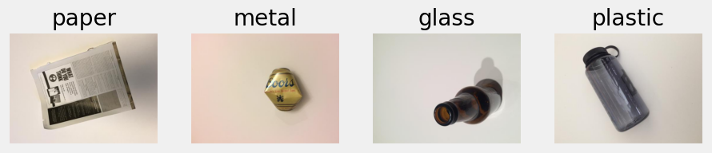
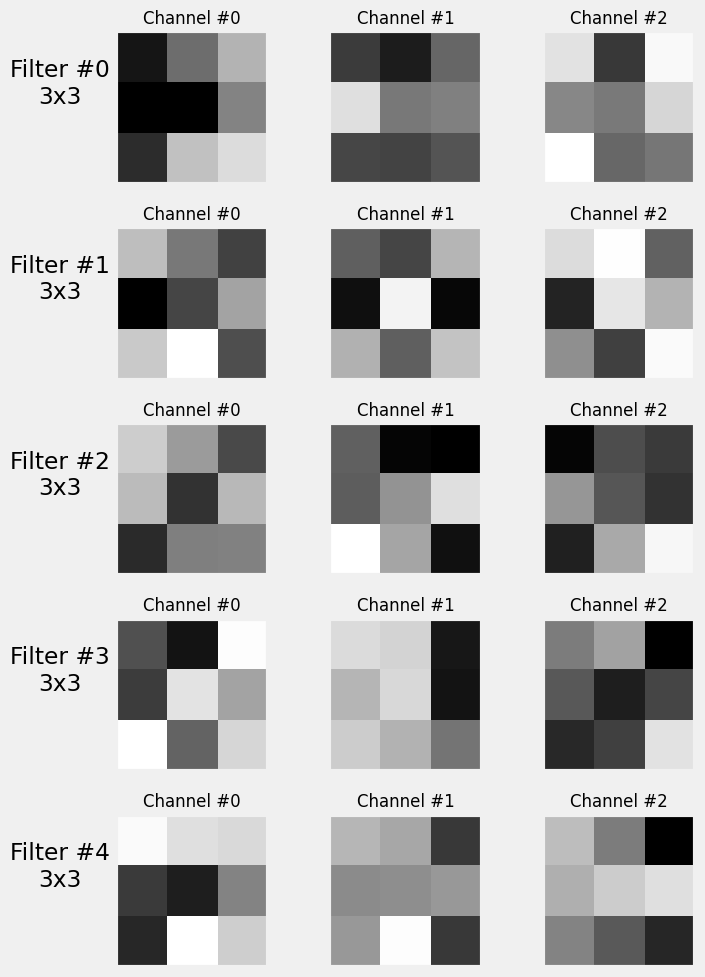
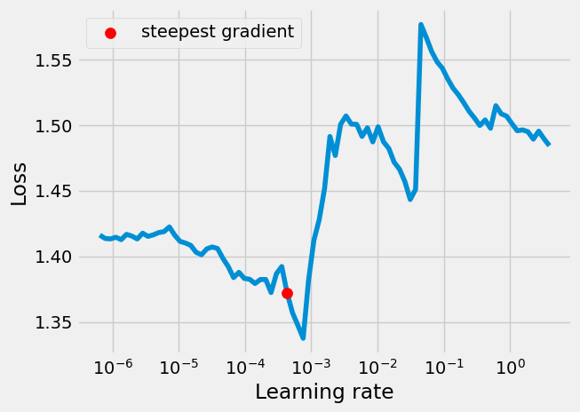
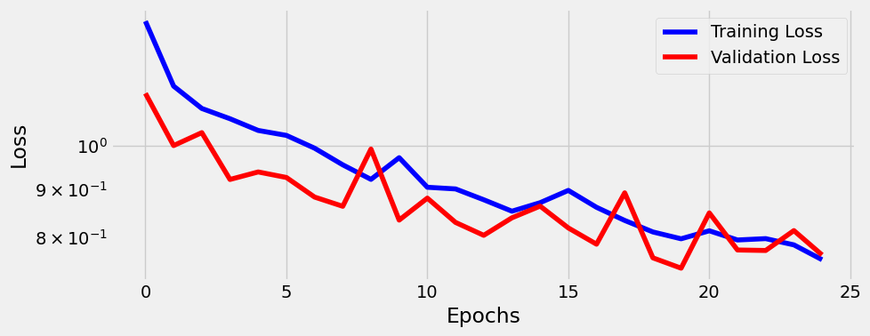
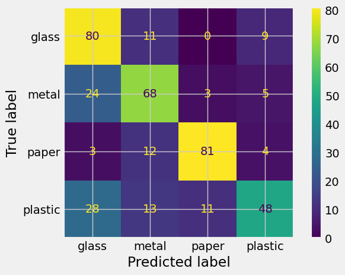

# Classificador de Materiais Recicláveis

## 📌 Visão Geral

Este projeto apresenta uma solução de aprendizado de máquina, implementada em PyTorch, para realizar a classificação automática de imagens de resíduos recicláveis em quatro classes distintas: glass, metal, paper e plastic. Trata-se de um problema de classificação multiclasse, com foco em redes neurais convolucionais (CNNs) aplicadas à Visão Computacional.

A arquitetura do modelo foi encapsulada na classe Architecture, responsável por organizar todo o pipeline de pré-processamento, treinamento, validação e inferência, com suporte a execução em GPU.

O projeto foi desenvolvido como parte da avaliação final da disciplina PPGEEC2318 - Machine Learning ministrada pelo Prof. Dr. Ivanovitch Medeiros, do Programa de Pós-Graduação em Engenharia Elétrica e de Computação da UFRN.

## 📂 Dataset

O conjunto de dados utilizado é uma adaptação do `TrashNet: A set of annotated images of trash that can be used for object detection Dataset`, desenvolvido pelo Polygence Project e disponibilizado na plataforma Roboflow.

Embora o dataset original contenha seis classes (cardboard, glass, metal, paper, plastic e trash), este projeto considera apenas as quatro categorias relacionadas à coleta seletiva: glass, metal, paper e plastic.

Foram utilizadas 400 imagens de treinamento e 100 imagens de validação para cada classe, em que cada uma delas tem 512x384 pixels. A Figura a seguir contém uma imagem de cada classe presente no dataset.

  

## Arquitetura e Desenvolvimento dos Modelos

A metodologia utilizada consistiu na implementação de dois modelos CNN (modelo base e modelo pessoal), buscando observar como alterações na arquitetura e no learning rate afetam no desempenho da classificação.

### Modelo Base

Este modelo, implementado no arquivo `ClassifierModelBase.ipynb`, utiliza uma arquitetura baseada no material de aula disponibilizado pelo professor. No pré-processamento, as imagens passaram apenas pelas transformações essenciais de redimensionamento (para o tamanho esperado pela rede) e conversão para o formato de tensor PyTorch.

A arquitetura da rede consiste em uma CNN sequencial com a seguinte estrutura:

- Bloco Convolucional 1: Uma camada Conv2d com 16 filtros, seguida por uma função de ativação ReLU e uma camada de MaxPool2d.
- Bloco Convolucional 2: Uma camada Conv2d com 32 filtros, também seguida por ReLU e MaxPool2d.
- Classificador: Duas camadas lineares (Linear) para realizar a classificação final nas quatro categorias.

-> 🔍 Visualizações: Filtros e Hooks

Para entender o comportamento interno da rede, foram utilizados filtros e hooks. Os filtros da primeira camada convolucional (conv1), foram visualizados para inspecionar os tipos de características que o modelo aprendia a detectar nos estágios iniciais (ex: bordas, texturas e padrões simples). Ao passo que os filtros da segunda camada (conv2) aprendem a combinar essas características simples para identificar padrões mais complexos e abstratos, como texturas específicas de cada material ou formas mais definidas. Tais filtros podem ser vistos adiante.

  

  

Já os hooks foram utilizados para visualizar a transformação das imagens ao longo das camadas convolucionais, permitindo compreender o que cada camada aprende e como os filtros atuam sobre os dados. A seguir, são apresentados, respectivamente, os feature maps extraídos das camadas do featurizer (conv1, conv2) e do classifier (fc1, fc2).

  

  

### Modelo Pessoal

Partindo da análise do modelo anterior, foi desenvolvido o `ClassifierPersonalModel.ipynb`. Esta implementação aplica alterações na preparação dos dados e na arquitetura da rede com o objetivo de construir uma rede mais robusta, capaz de aprender características mais detalhadas das imagens.

As principais modificações introduzidas foram:

- Aumento da Resolução da Imagem: O tamanho das imagens de entrada foi alterado de 28x28 para 128x128 pixels. Essa mudança é fundamental, pois imagens com maior resolução contêm mais detalhes visuais. Para um problema de classificação de materiais, onde texturas sutis e padrões finos são importantes para a diferenciação (como o brilho do vidro ou a rugosidade do papel), fornecer mais pixels à rede permite que as camadas convolucionais extraiam características mais ricas e discriminativas, potencializando a precisão do modelo.

- Preparação de Dados com Data Augmentation: Para aumentar a robustez e a capacidade de generalização do modelo, foram aplicadas transformações aleatórias nas imagens de treinamento, como RandomHorizontalFlip (espelhamento horizontal), RandomRotation (rotações) e ColorJitter (alterações de brilho, contraste e saturação).

- Aumento da Complexidade da Arquitetura: O número de filtros nas camadas convolucionais foi expandido progressivamente para permitir que a rede aprendesse padrões mais complexos a partir dos dados de maior resolução. A arquitetura conta com 3 camadas convolucionais, sendo a primeira com n_feature filtros, a segunda com n_feature * 2 filtros e a terceira com n_feature * 4 filtros. Essa configuração amplia significativamente a capacidade da rede de extrair representações hierárquicas dos dados de entrada.

- Adição de Camadas de Regularização e Estabilização: Para gerenciar a maior complexidade da rede e mitigar o risco de overfitting, foram adicionadas camadas de BatchNorm2d após cada convolução para estabilizar o treinamento, e camadas de Dropout nas etapas finais do classificador.

- Adoção da técnica de early stopping: Interrompe o treinamento automaticamente ao detectar estagnação na validação, evitando sobreajuste e contribuindo para um modelo mais generalizável.

## 📊 Resultados e Desempenho

Para o treinamento do Modelo Base, foi utilizado um número inicial de 5 filtros na primeira camada convolucional. A função de perda adotada foi a Cross-Entropy Loss (nn.CrossEntropyLoss), combinada com o otimizador Adam e uma taxa de aprendizado (learning rate) de 3e-4. O treinamento foi realizado ao longo de 10 épocas.

A figura a seguir apresenta a curva de perda durante o treinamento, mostrando a evolução das perdas de treinamento (em azul) e validação (em vermelho). Ambas iniciam com valores em torno de 1.37 e apresentam uma queda constante ao longo das épocas, alcançando aproximadamente 1.18 ao final do processo. Esse comportamento indica um aprendizado estável e sem overfitting. No entanto, os valores finais ainda relativamente altos sugerem que o Modelo Base possui limitações na extração de padrões mais representativos, motivando o desenvolvimento de arquiteturas mais complexas nos modelos seguintes.

  

Para o treinamento do Modelo Pessoal, foram utilizadas 32 features na primeira camada convolucional e taxa de dropout de 0.18, com o objetivo de aumentar a capacidade de generalização da rede. A função de perda adotada foi novamente a Cross-Entropy Loss com média (reduction='mean'), e o otimizador escolhido foi o Adam, agora com uma taxa de aprendizado ajustada para aproximadamente 7.35e-5 e regularização L2 (weight decay) de 1e-4. O modelo foi treinado por 31 épocas.

Essa abordagem resultou em um modelo mais eficiente, com ganhos visíveis na curva de perda. Dessa forma, a figura a seguir mostra que as perdas de treinamento e validação caem progressivamente até cerca da 15ª época, atingindo valores em torno de 0.55. Após esse ponto, a perda de validação apresenta certa oscilação, sinalizando um início de overfitting leve, mas ainda assim mantém desempenho superior ao modelo base. O comportamento geral da curva reflete um aprendizado mais consistente e uma maior capacidade de generalização.

  

Quanto às métricas de desempenho, a tabela evidencia uma melhora significativa do modelo pessoal em relação ao modelo base, onde o primeiro atingiu cerca de 74% de acurácia, com precision, recall e f1-score mais equilibrados entre as classes, refletindo um desempenho mais consistente.

|                | **Accuracy** | **Precision** |  **Recall** | **F1-Score** |
|----------------|--------------|---------------|-------------|--------------|
| Modelo Base    |    50,75%    |     50,93%    |    50,75%   |    50,42%    |
| Modelo Pessoal |    74,75%    |     76,42%    |    74,75%   |    74,30%    |

As matrizes de confusão confirmam essa evolução, mostrando maior concentração de acertos na diagonal principal e redução nos erros de classificação. Isso indica que o modelo foi mais eficaz em distinguir corretamente entre as quatro classes.

  

  

Esses resultados comprovam que a nova arquitetura e a otimização dos hiperparâmetros contribuíram para uma melhor generalização e precisão.

## Análise de Learning Rate

Para refinar ainda mais o "Modelo Pessoal", foi utilizada a técnica Learning Rate Finder (LRFinder). O LRFinder treina o modelo por algumas iterações, começando com uma taxa de aprendizado (LR) muito baixa e aumentando-a exponencialmente a cada passo. Ao plotar a perda em função do LR, é possível identificar a faixa de valores onde a perda diminui mais rapidamente, indicando uma taxa de aprendizado ideal. A imagem a seguir é a gráfico do LR aplicado ao modelo pessoal.

  

Com base na sugestão do LRFinder o valor de learning rate 4.33e-04 foi selecionado e aplicado para treinar novamente o modelo. O desempenho desta nova versão foi avaliado por meio do gráfico de perda e da matriz de confusão, apresentados a seguir.

  

  

Como é possível observas na imagens, a aplicação da taxa de aprendizado sugerida pelo LRFinder resultou em um desempenho ligeiramente inferior ao do modelo com o learning rate ajustado manualmente.

## Conclusão

O desenvolvimento deste projeto evidenciou a importância da escolha adequada de arquiteturas e da otimização de hiperparâmetros no desempenho de modelos de classificação baseados em redes neurais. Por meio de ajustes no Modelo Pessoal, foi possível alcançar métricas superiores em relação ao Modelo Base, demonstrando maior capacidade de generalização e discriminação entre as classes.

Durante o processo de ajuste, foi utilizada a técnica learning rate finder como alternativa para definição da taxa de aprendizado. Embora os resultados iniciais não tenham sido os mais ideais neste caso específico, a abordagem ainda se mostra válida como ponto de partida para ajustes posteriores mais refinados.

## 🔗 Referências

* [Roboflow - trashnet Computer Vision Project](https://universe.roboflow.com/myspace-uc4uq/trashnet-sn7pu)
* [Repositório do Prof Dr. Ivanovitch](https://github.com/ivanovitchm/PPGEEC2318)

## 👥 Colaboradores

* Adson Emanuel
* Klyfton Stanley
