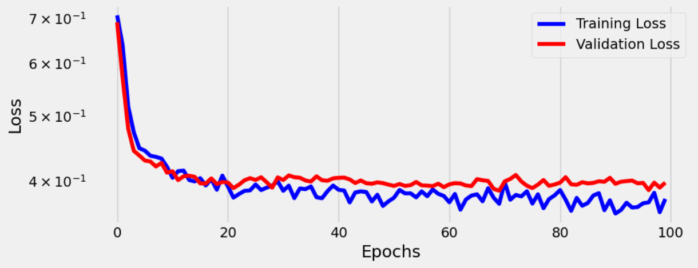
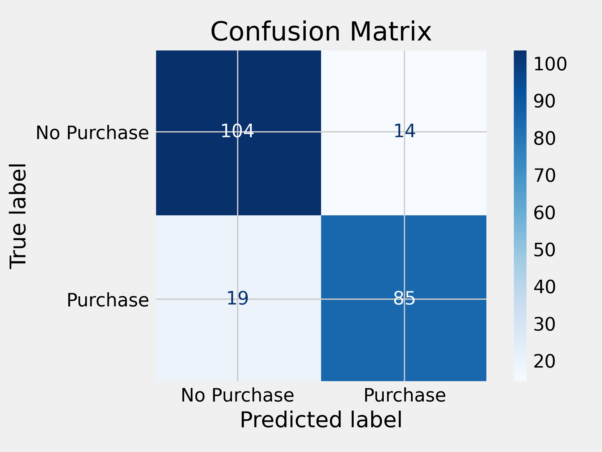
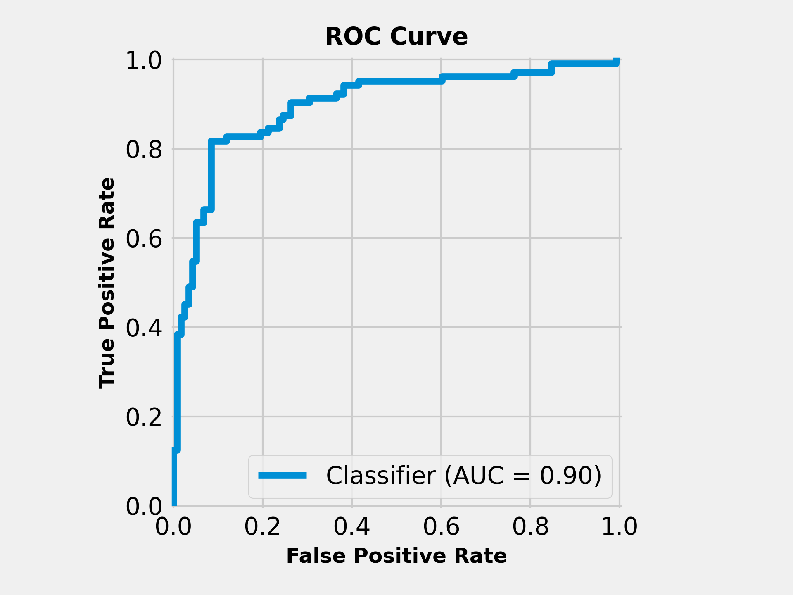
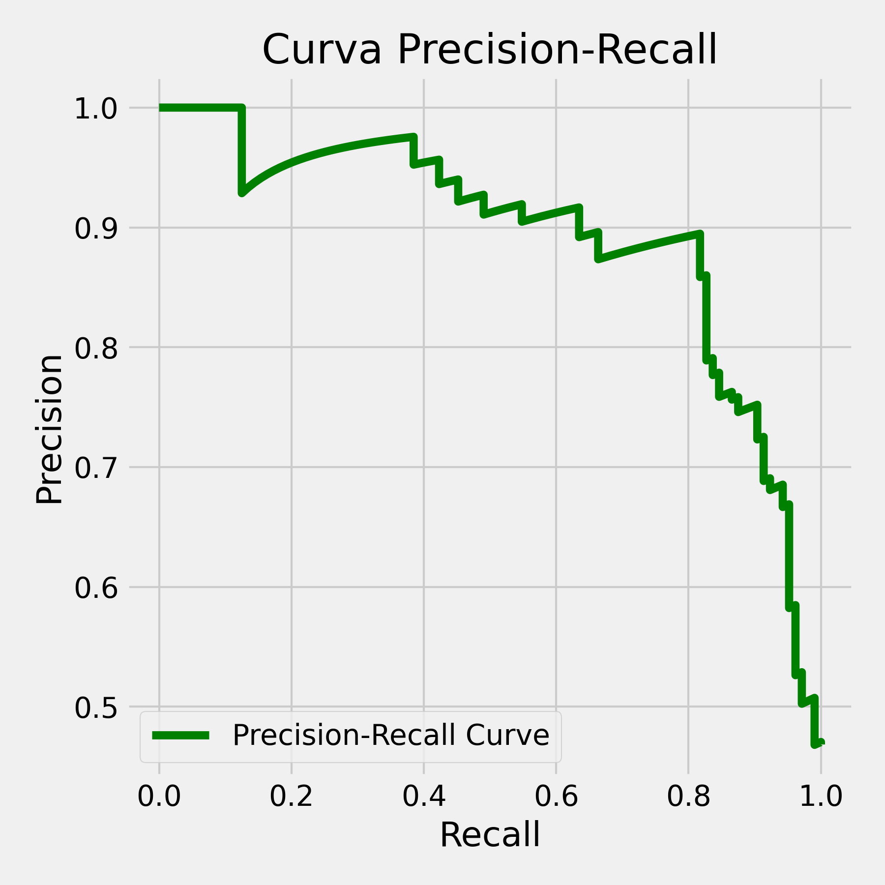

# Customer Purchase Prediction - Binary Classification

## 📌 Visão Geral

Este projeto apresenta um modelo de aprendizado de máquina criado no PyTorch para prever a probabilidade de um cliente fazer uma compra, com base em características demográficas e comportamentais. Ele aborda um problema de classificação binária usando um conjunto de dados disponível publicamente no Kaggle.

O modelo tem como objetivo ajudar as empresas a entender o comportamento do cliente e direcionar os possíveis compradores de forma mais eficaz.

## 📂 Dataset
- Fonte: [Kaggle - Predict Customer Purchase Behavior](https://www.kaggle.com/datasets/rabieelkharoua/predict-customer-purchase-behavior-dataset/data)
- Características:
  - Age: idade do cliente;
  - Gender: gênero do cliente (0: masculino, 1: feminino)
  - Annual Income: renda anual do cliente em dólares
  - Number of Purchases: número total de compras feitas pelo cliente
  - Product Category: categoria do produto comprado (0: Eletrônicos, 1: Roupas, 2: Artigos para o lar, 3: Beleza, 4: Esportes)
  - Time Spent on Website: tempo gasto pelo cliente no site em minutos
  - Loyalty Program: se o cliente é membro do programa de fidelidade (0: Não, 1: Sim)
  - Discounts Availed: número de descontos aproveitados pelo cliente (intervalo: 0-5)
- Variável Alvo 🎯:
  - Purchase Status: probabilidade de o cliente fazer uma compra (0: Não, 1: Sim)

## 🛠️ Project Pipeline

O arquivo referente a etapa da EDA pode ser visto aqui: [eda.ipynb](https://github.com/AdEmanuel/PPGEEC2318/blob/main/Customer%20Purchase%20Behavior%20Prediction/eda.ipynb), ao passo que o arquivo 
contendo os passos descritos nas etapas 2, 3 e 4 é o [purchase_classifier.ipynb](https://github.com/AdEmanuel/PPGEEC2318/blob/main/Customer%20Purchase%20Behavior%20Prediction/purchase_classifier.ipynb).

### 1. Exploratory Data Analysis (EDA)
Durante a etapa de Análise Exploratória dos Dados, observou-se que a variável-alvo (_Purchase Status_) apresenta um desbalanceamento entre as classes, o que poderá influenciar negativamente o desempenho do modelo se não for tratado adequadamente. Além disso, verificou-se que as variáveis _Loyalty Program_ e _Discounts Availed_ demonstram maior correlação com a variável de saída, indicando um impacto maior que as outras no comportamento de compra dos clientes.

No que diz respeito às variáveis numéricas, foi identificado que estas operam em escalas bastante distintas — por exemplo, a variável _Annual Income_ varia aproximadamente entre 20.000 e 150.000, enquanto _Age_ apresenta valores entre 18 e 70. Já entre as variáveis categóricas, a maioria apresenta duas categorias, com exceção da variável _Product Category_, que contém 5 classes distintas. Tais característica tornam necessário o emprego de técnicas de normalização dos dados e codificação categórica.

### 📚 2. Dados de avaliação

O conjunto de dados em estudo é dividido em Train e Test durante o estágio Segregate do pipeline de dados. 80% dos dados limpos são usados para treinar e os 20% restantes para testar. Além disso, 20% dos dados do Train são usados para fins de validação.

### 💪 3. Treinamento

*3.1 Preprocessing and Tensor Preparation*

Antes do treinamento, os dados foram processados utilizando pipelines do Scikit-learn, com codificação one-hot aplicada às variáveis categóricas e normalização padronizada para as variáveis numéricas. Em seguida, a técnica SMOTE foi utilizada para balancear a variável alvo na base de treino. Os dados resultantes foram convertidos em tensores utilizando o PyTorch, sendo organizados em TensorDatasets e carregados em mini-lotes com o auxílio da classe DataLoader.

*3.2 Model*

O modelo treinado é uma rede neural simples configurada para tarefa de classificação binária. Sua estrutura está encapsulada na classe LogisticRegressionModel. A função de perda utilizada foi BCEWithLogitsLoss e o otimizador escolhido foi o Adam, com taxa de aprendizado de 0.01.

*3.3 Training Framework*

A classe `Architecture` foi projetada para gerenciar de forma abrangente todas as etapas do processo de treinamento de modelos, incluindo a validação e o mecanismo de checkpointing. Ela encapsula as operações de propagação direta, retropropagação, atualização dos pesos e cálculo das métricas de desempenho, trabalhando diretamente com tensores e garantindo compatibilidade com execução em GPU.

Além disso, ela oferece suporte para salvar e recuperar o estado do modelo — incluindo os weights e os parâmetros do otimizador —, o que é fundamental para garantir a reprodutibilidade dos resultados, permitir a retomada de treinamentos interrompidos e facilitar a posterior implantação do modelo treinado. 

No presente projeto, a classe foi utilizada para treinar o classificador ao longo de 100 épocas. A cada época, o modelo era avaliado tanto nos dados de treino quanto nos dados de validação, possibilitando o monitoramento contínuo da aprendizagem e a mitigação de overfitting.

### 📊 4. Curva de Perda (Loss Curve) e Métricas de Desempenho

A curva de perda evidencia uma boa convergência ao longo das 100 épocas, com ambas as curvas — de treino e de validação — apresentando tendência de estabilização após aproximadamente 20 iterações. A proximidade entre as curvas sugere que não houve overfitting relevante, indicando um bom equilíbrio entre aprendizado e generalização.

  

Quanto às métricas de desempenho, o modelo apresentou resultados satisfatórios para uma tarefa de classificação binária:

|  Métrica     | Valor   |
|--------------|---------|
| **Accuracy** | 85,14%  |
| **Precision**| 85,86%  |
| **Recall**   | 81,73%  |
| **F1-Score** | 83,74%  |

Esses indicadores refletem uma boa performance do modelo, o que é corroborado pela análise da matriz de confusão:

  

Obesrva-se um bom número de classificações corretas em relação às incorretas. Isso demonstra que o modelo é eficaz tanto em identificar corretamente se o indivíduo irá realizar uma compra (classe _Purchase_ ) quanto em evitar alarmes falsos (classe _No Purchase_).

Esses resultados são ainda complementados pela curva ROC, cuja área sob a curva (AUC = 0.8970) evidencia uma boa capacidade discriminativa, com a proximidade ao canto superior esquerdo do gráfico representando uma alta taxa de verdadeiros positivos com uma baixa taxa de falsos positivos:

  

Já a curva Precision-Recall mostra que o modelo mantém, em grande parte, uma precisão consistente mesmo com o aumento do recall, o que é relevante em contextos com possível desbalanceamento entre as classes:

  

## Referências

- [Kaggle - Predict Customer Purchase Behavior](https://www.kaggle.com/datasets/rabieelkharoua/predict-customer-purchase-behavior-dataset/data)
- [Repositório do Prof Dr. Ivanovitch](https://github.com/ivanovitchm/PPGEEC2318)

## Colaboradores
- Adson Emanuel
- Klyfton Stanley

